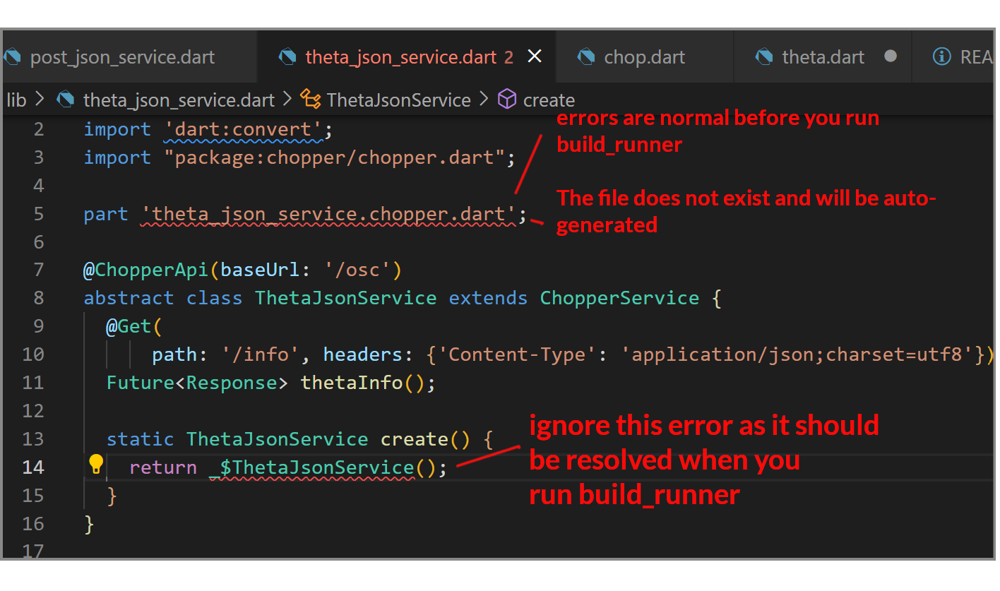
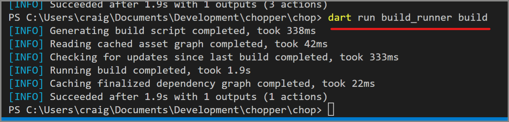
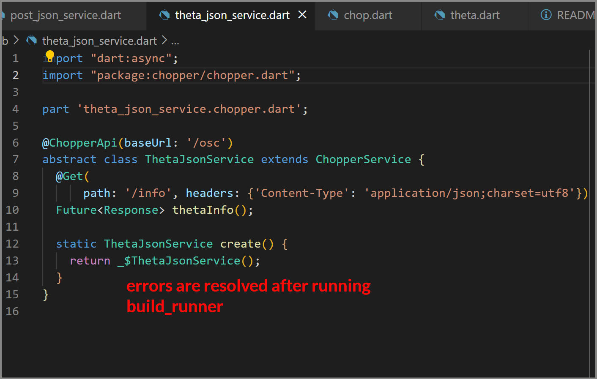

# Chopper Minimum Example

Minimal examples are useful to show the fundamental basic commands and syntax.

Chopper is an http client.

There are two examples:

1. chop.dart - goes to fake data server on the Internet and pulls down fake information from the API endpoint
2. theta.dart - must be connected to the RICOH THETA camera


## Use

### Fake Data Server on Internet

`dart bin/chop.dart` will pull a set of fake data posts from jsonplaceholder (free site)

### Connected by Wi-Fi to RICOH THETA Camera

```
dart .\bin\theta.dart
{api: [/osc/info, /osc/state, /osc/checkForUpdates, /osc/commands/execute, /osc/commands/status], apiLevel: [2], _bluetoothMacAddress: 58:38:79:46:F8:ED, endpoints: {httpPort: 80, httpUpdatesPort: 80}, firmwareVersion: 1.10.1, gps: true, gyro: true, manufacturer: Ricoh Company, Ltd., model: RICOH THETA X, serialNumber: 14010001, supportUrl: https://theta360.com/en/support/, uptime: 255, _wlanMacAddress: AC:12:03:D9:78:62}
```

## Concept

* `build_runner code generation`

## Development



### running build_runner

`dart run build_runner build`




Errors are resolved.



## Additional Information

https://github.com/codetricity/theta_bloc_chop
